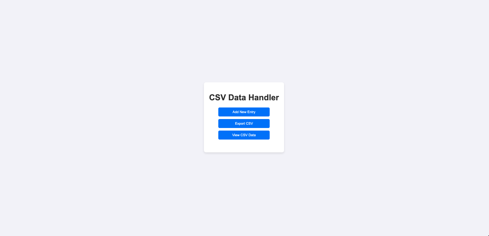
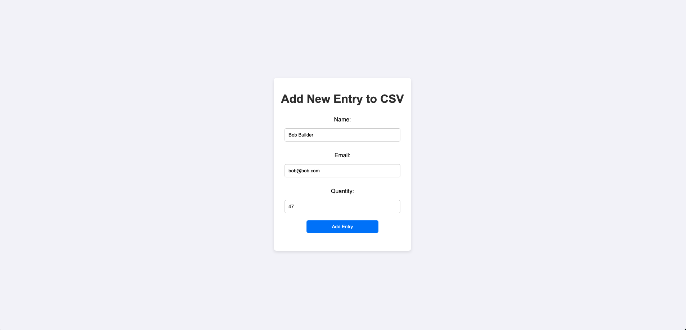
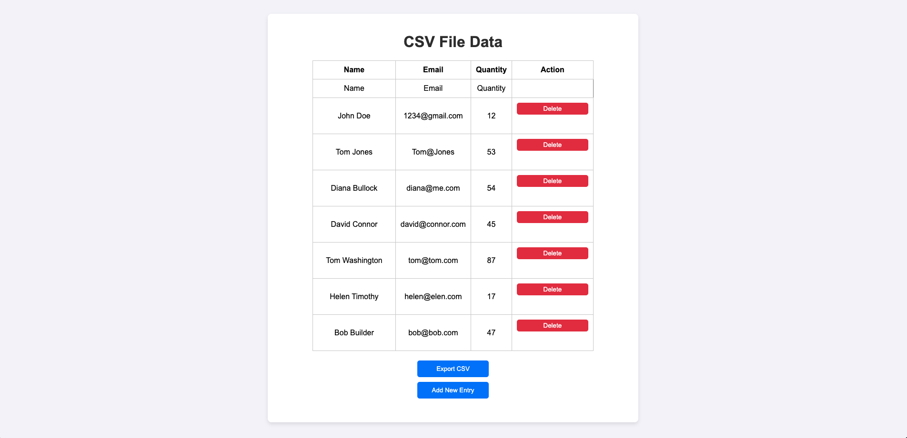
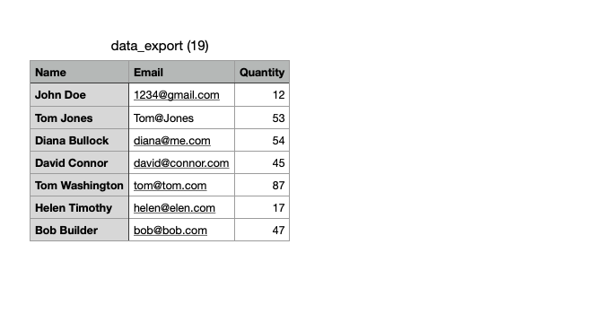

# CSV Import and Export Handler whit PHP

## Overview

This project is a PHP-based system that handles CSV file import and export operations. Users can add, view, and delete data from a CSV file.

## Features

- Add new data entries to CSV.
- View CSV data in a table format.
- Delete individual rows from CSV.
- Export CSV file for download.

## Project Screenshots

Here are some screenshots of the project in action:

### 1. Start selection

### 2. Add New Entry

### 3. View CSV Data and Delete an Entry

### 4. Export CSV Data

## Video Demo

Watch a video demo of the project in action:

[Watch the video demo](https://youtu.be/yZtQudOa9tM)

## How to Use

1. **Add New Entry:** Navigate to `add.php` and fill out the form.
2. **View CSV Data:** Visit `import.php` to view the current CSV data.
3. **Delete a Row:** Click the delete button next to any row in the table.
4. **Export CSV:** Download the CSV file by visiting `export.php`.

## License

This project is open source and licensed under the [MIT License](LICENSE).
